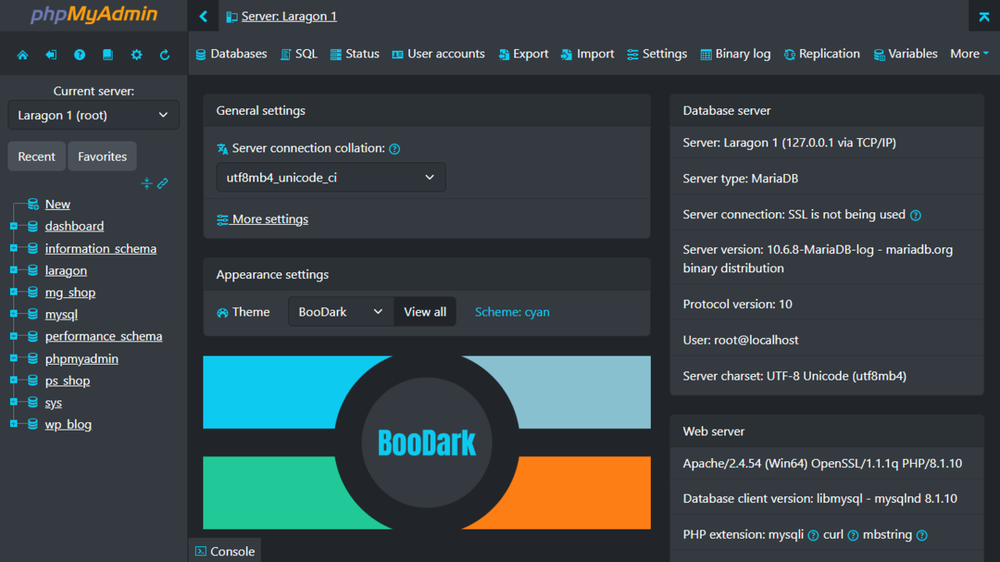

# OrzedPMA v1.0.0



## Visuals


Modern near-dark theme for phpMyAdmin 5.2.x with muted accents, low glare, and minimal color noise.

## Highlights

- Calm, near-dark palette with restrained accent colors
- Unified navigation/background surfaces with subtle separation
- Local fonts and Font Awesome assets (no external runtime dependencies)
- Icon system mapped to Font Awesome SVGs

## Install

1. Copy the theme folder to: `phpmyadmin/themes/orzedpma`
2. Set in `config.inc.php`:

```php
$cfg['ThemeDefault'] = 'orzedpma';
```

## Build (SCSS)

Prereqs: `sass` and `rtlcss` (Node.js).

```bash
sass --style=compressed --source-map --load-path=scss/vendors scss/theme.scss css/theme.css
rtlcss css/theme.css css/theme.rtl.css
```

## Logo link (optional)

To link the navigation logo to Orzed Software:

```php
$cfg['NavigationLogoLink'] = 'https://www.orzed.com';
$cfg['NavigationLogoLinkWindow'] = 'new';
```

## Notes

- Font Awesome assets are bundled locally in `webfonts/` and `svgs/`.
- Supported versions: 5.2
- Bootstrap: v5.3.x

## Author & Links

- GitHub: https://github.com/ugurakcil
- Instagram: https://instagram.com/datasins
- LinkedIn: https://www.linkedin.com/in/ugurakcil/
- Website: https://ugurakcil.com
- Website: https://datasins.com
